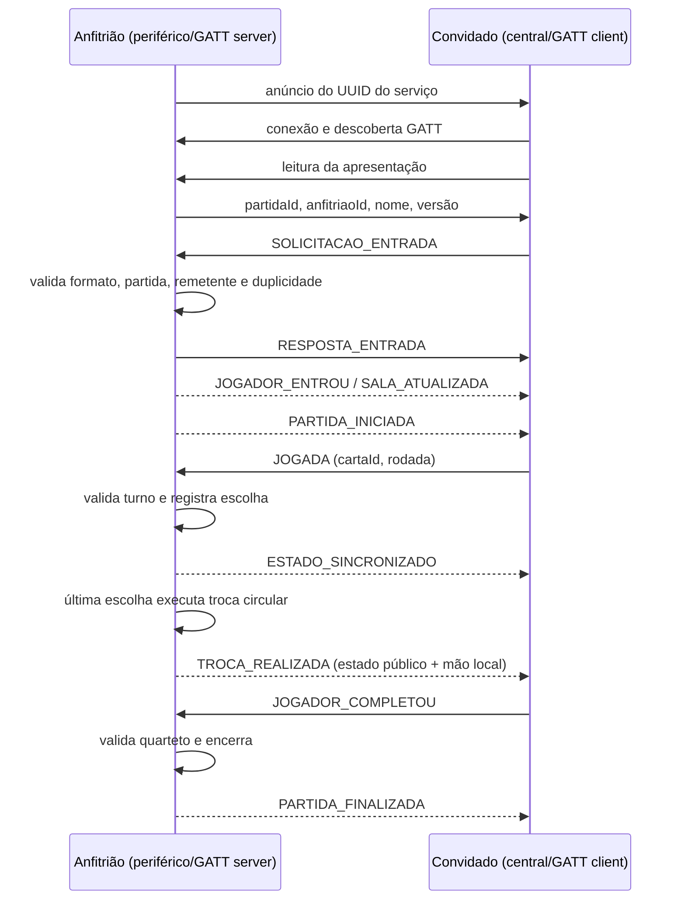

# Protocolo Bluetooth do Burro

Status: integração concluída e aprovada em testes automatizados/compilação. A validação entre aparelhos físicos permanece pendente.

## Papéis e topologia

- Anfitrião: periférico BLE, anunciante, servidor GATT e autoridade da sala/partida.
- Convidados: centrais BLE, scanners e clientes GATT.
- Central: `@capacitor-community/bluetooth-le` 8.3.0.
- Periférico: plugin nativo `BurroBlePeripheralPlugin`, registrado no app Android.
- Limite implementado: 6 jogadores no total, isto é, 1 anfitrião e até 5 convidados.

O plugin comunitário suporta somente o papel central. O complemento nativo implementa anúncio, publicação do serviço, leitura da apresentação da sala, recebimento de escritas, notificações direcionadas e eventos de conexão/desconexão.

## Serviço GATT

| Item | UUID | Direção |
|---|---|---|
| Serviço Burro | `7b757272-6f00-4a6f-676f-427572726f01` | — |
| Entrada | `7b757272-6f00-4a6f-676f-427572726f02` | cliente escreve no anfitrião |
| Eventos | `7b757272-6f00-4a6f-676f-427572726f03` | cliente lê apresentação; anfitrião notifica |

Antes de solicitar entrada, o convidado lê a característica de eventos e recebe `partidaId`, `anfitriaoId`, nome do anfitrião e versão do protocolo. Assim, até a primeira mensagem já contém o ID real da partida.

## Envelope JSON

```json
{
  "versao": 1,
  "id": "uuid-da-mensagem",
  "tipo": "JOGADA",
  "partidaId": "a1b2c3d4",
  "remetenteId": "uuid-do-jogador",
  "sequencia": 12,
  "enviadaEm": "2026-09-30T18:00:00.000Z",
  "dados": {
    "cartaId": "carta-7-copas",
    "rodada": 4
  }
}
```

O limite por mensagem remontada é 8 KiB. O decodificador rejeita JSON inválido, versão desconhecida, campos ausentes, data inválida, payload incompatível com o tipo e mensagens grandes demais.

## Tipos de mensagem

| Tipo | Direção principal | Uso |
|---|---|---|
| `SOLICITACAO_ENTRADA` | convidado → anfitrião | nome e ID do candidato |
| `RESPOSTA_ENTRADA` | anfitrião → convidado | aceite/recusa e motivo; no aceite inclui a sala |
| `JOGADOR_ENTROU` | anfitrião → convidados | participante aceito e lista atualizada |
| `JOGADOR_SAIU` | convidado → anfitrião | saída voluntária ou abandono |
| `SALA_ATUALIZADA` | anfitrião → convidados | lista e estados de conexão autoritativos |
| `SALA_ENCERRADA` | anfitrião → convidados | encerramento voluntário pelo anfitrião |
| `PARTIDA_INICIADA` | anfitrião → convidado | estado público e mão privada do destinatário |
| `JOGADA` | convidado → anfitrião | ID da carta escolhida e rodada |
| `TROCA_REALIZADA` | anfitrião → convidado | estado público e nova mão privada após troca atômica |
| `JOGADOR_COMPLETOU` | jogador → anfitrião | solicitação de declaração de quarteto |
| `ACAO_RECUSADA` | anfitrião → convidado | motivo de comando inválido ou fora do turno |
| `PARTIDA_FINALIZADA` | anfitrião → convidado | estado e resultado personalizados |
| `JOGADOR_DESCONECTADO` | anfitrião → convidados | participante offline e possibilidade de retorno |
| `RECONEXAO` | convidado → anfitrião | recupera vínculo por ID e sequência conhecida |
| `ESTADO_SINCRONIZADO` | anfitrião → convidado | instantâneo público e mão privada individual |

## Fragmentação por MTU

O JSON é convertido para UTF-8 e dividido em frames binários. Cada frame possui cabeçalho de 10 bytes:

| Bytes | Conteúdo |
|---|---|
| 0 | marcador `0x42` |
| 1 | versão do frame (`1`) |
| 2–5 | ID de transferência de 32 bits |
| 6–7 | índice do fragmento |
| 8–9 | total de fragmentos |
| 10+ | trecho UTF-8 |

Convidados usam o MTU informado pelo plugin, descontando os 3 bytes do ATT. O anfitrião envia frames de 20 bytes, compatíveis com o MTU BLE mínimo de 23. Transferências incompletas expiram em 15 segundos e aceitam no máximo 1.024 fragmentos.

## Validação e autoridade

Antes de alterar o estado, o receptor verifica:

1. esquema do envelope e payload específico;
2. `partidaId` igual à sessão atual;
3. `remetenteId` igual ao jogador vinculado ao dispositivo;
4. ID da mensagem ainda não processado;
5. sequência maior que a última aceita daquele remetente;
6. tipo permitido na fase atual.

O anfitrião mantém a lista e as mãos autoritativas. Dispositivos fisicamente conectados mas ainda não aceitos não recebem a lista da sala. Comandos são aceitos somente durante a partida e o anfitrião valida rodada, turno, posse da carta, declaração do quarteto e estado de conexão.

O tipo público `EstadoPublicoPartida` não possui o mapa de mãos nem IDs de cartas escolhidas. `PARTIDA_INICIADA`, `TROCA_REALIZADA` e `ESTADO_SINCRONIZADO` são montadas separadamente para cada dispositivo e levam somente sua `maoLocal`.

## Fluxo implementado



## Permissões e falhas

- Android 12+: `BLUETOOTH_SCAN`, `BLUETOOTH_CONNECT` e `BLUETOOTH_ADVERTISE` em tempo de execução.
- Android 11 ou anterior: permissões Bluetooth legadas e localização limitada à API 30.
- O scan usa `neverForLocation`; o jogo não deriva localização.
- Permissão negada gera mensagem e atalho para as configurações do app.
- Bluetooth desligado gera mensagem e ação para solicitar ativação.
- Aparelho sem `isMultipleAdvertisementSupported` pode entrar, mas não hospedar.
- Falha de conexão volta à interface com erro em português.

## Reconexão e limitações

O convidado tenta reconectar ao último `deviceId` quatro vezes, com esperas de 1, 2, 4 e 8 segundos. Ao retornar, envia seu ID e a última sequência recebida. O anfitrião só restaura jogadores que já pertenciam à sala e exige que a conexão venha do mesmo identificador BLE aceito originalmente.

Limitações atuais:

- reconexão automática ocorre enquanto o processo do aplicativo continua ativo;
- endereço/identificador BLE pode mudar em alguns aparelhos ou após reinício do sistema; nesse caso a reconexão segura é recusada;
- se o anfitrião fechar o app ou recriar a sala, a partida anterior não pode ser retomada;
- enquanto qualquer jogador está desconectado o anfitrião pausa novas jogadas; após quatro tentativas sem sucesso, o convidado registra localmente uma interrupção;
- Android limita quantidade e estabilidade de conexões conforme fabricante;
- funcionamento em segundo plano não é garantido e não faz parte desta etapa;
- somente teste em aparelhos reais pode validar rádio, permissões do fabricante e entrega nos dois sentidos.
